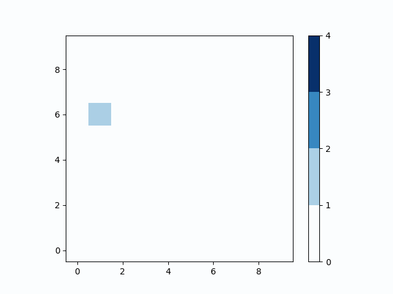

# Reinforcement Learning to Solve the Abelian Sandpile Game

## Introduction

This repository contains a PyTorch implementation of a Reinforcement Learning (RL) policy agent using the REINFORCE/policy gradient algorithm. The agent is trained to maximize the score in a simulated Abelian sandpile game, which is a classic system exhibiting self-organized criticality, and is meant to provide a brief investigation to neural networks' ability to learn environments exhibiting self-organized criticality.

### Abelian Sandpile Game


The [Abelian sandpile model](https://en.wikipedia.org/wiki/Abelian_sandpile_model) is a cellular automaton that exhibits self-organized criticality. In this game, grains of sand are dropped onto a grid, and when a cell exceeds a certain threshold, it topples and distributes sand to its neighboring cells. The dynamics of the sandpile lead to emergent patterns and critical behavior, in which large 'avalanches' (large series of grains falling and sequentially displacing neighbors) cannot be easily anticipated. As with other systems exhibiting self-organized criticality, the dynamics of the sandpile game exhibit scale invariance (the size of the avalanche follows a power law distribution, where larger avalanches are less likely).

### Policy Gradients

The RL agent in this repository utilizes the *REINFORCE algorithm*, a policy gradient method. Policy gradients directly optimize the policy of the agent.

## Usage
### Dependencies
- PyTorch
- NumPy
- Matplotlib

### Training

To train the RL policy agent from scratch, use the following script:

```bash
python train_reinforce_agent.py
```


### Testing
To simulate the RL policy agent on the Abelian sandpile game for a single run, run the following notebook:
```bash
sim_rl_agent.ipynb
```

To simulate the agent on multiple runs to calculate statistics (e.g. percentiles of scores)
```bash
sim_rl_agent_multiple_runs.ipynb
```


### Animation
To generate an animation of the RL agent interacting with the sandpile for a single run, use the following script:
```bash
python animate_rl_agent.py
```

## How It Works


The trained RL policy learns to maximize its score within the sandpile game. Agents are allowed to move in any of the four cardinal directions (plus staying in place). The system is simulated as follows: During each step, the agent selects its move. A sandgrain is then dropped randomly on a location in the grid and incrementing the number of grains in that location, per the rules of the game. If any locations contain more than the threshold value of four grains, that location is toppled, decreasing its count by four and incrementing all available neighbors by one; if the location is at an edge or a corner, this leads to a net loss of grains. If the agent was at the location of the avalanche, it is moved into randomly into a neighboring cell (which, if the neihboring cell is off the grid, causes the agent to stop playing the game). This process continues until no more locations on the grid exceed the threshold value of four. The next step then commences and the process repeats. 

Agent score is calculated as follows: if the agent moved and wasn't avalanched, it accrues a reward equal to the number of sandgrains in its square; if it was avalanched at all (i.e. moved by an avalanche), it does not accrue any reward for the turn; finally, if it was avalanched off the grid, it leaves the game.

### Agent Functionality
[agents.py](agents.py): Implements the generic agent functionality in the simulation, including interaction with the sandpile environment. 

### RL Policy Class Implementations
[rl_agents.py](rl_agents.py): Contains the PyTorch implementation of the RL policy class.
### Tests
The [tests/](tests) folder contains unit tests for different components of the codebase, such as testing sandpile mechanics or agent movement.


## Contact

If you have any questions or would like to reach out to me, you can find me here: <br />
Email: leomed97@gmail.com <br />
